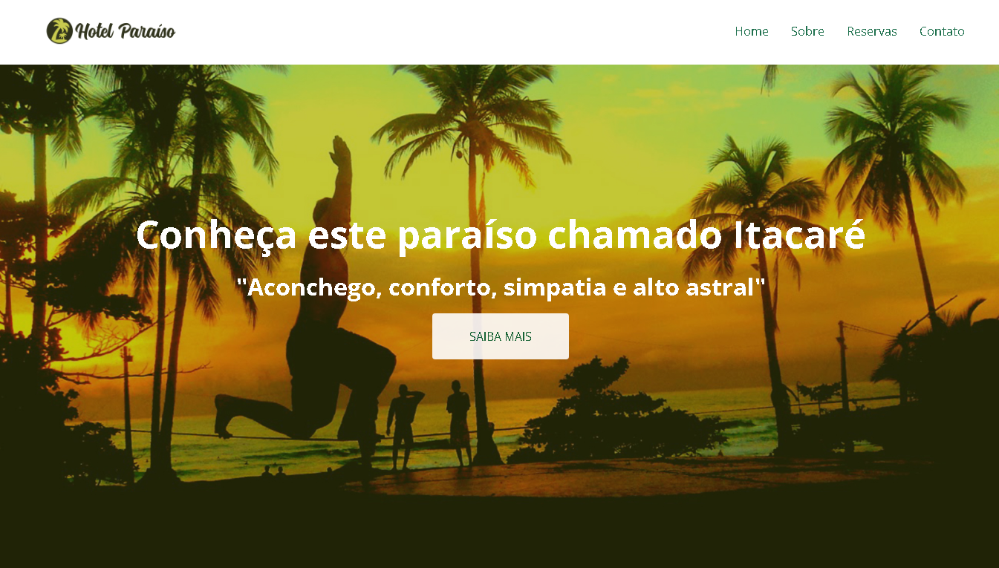
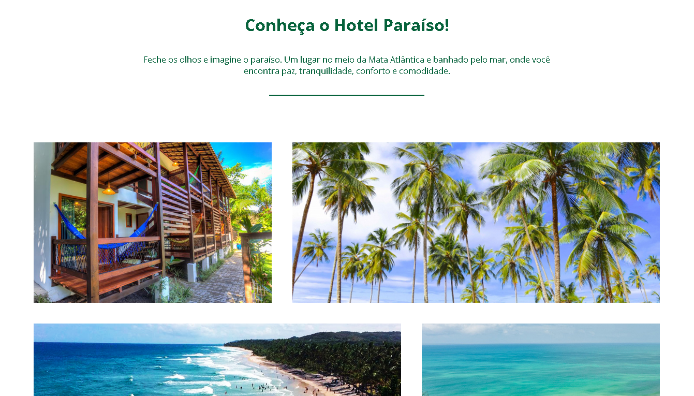
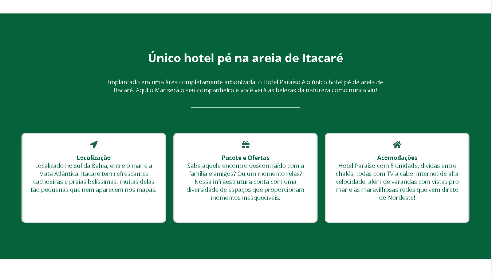
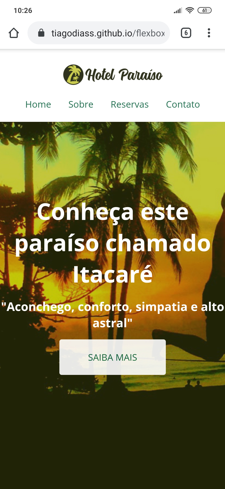
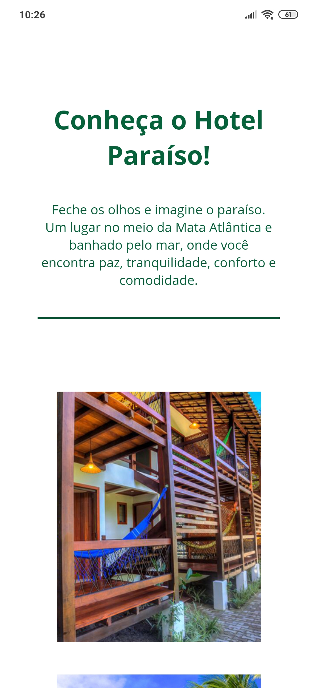
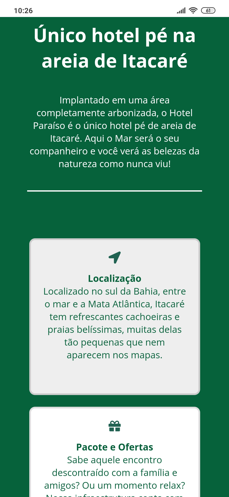

<h1 align="center">
  
</h1>

<h1 align="center">Flexbox Final Project</h1>
Este é o projeto final do curso de Flexbox ministrado pela <a href="https://www.youtube.com/channel/UCZZ0NTtOgsLIT4Skr6GUpAw">NodeStudio</a>, o qual usei para fixar e praticar meus conhecimentos sobre Flexbox.
O projeto se trata de um site responsivo para um hotel fictício, e no desenvolvimento desse site usei somente HTML e CSS.

## Resultado final :framed_picture:
Você pode ver o <strong>resultado final</strong> do projeto aqui: https://tiagodiass.github.io/flexbox-final-project

### Desktop :computer:

### Mobile :iphone:

---
:smiley: Espero que tenha gostado do projeto! 
:wave: [Meu contato](https://www.linkedin.com/in/tiagodiass)
